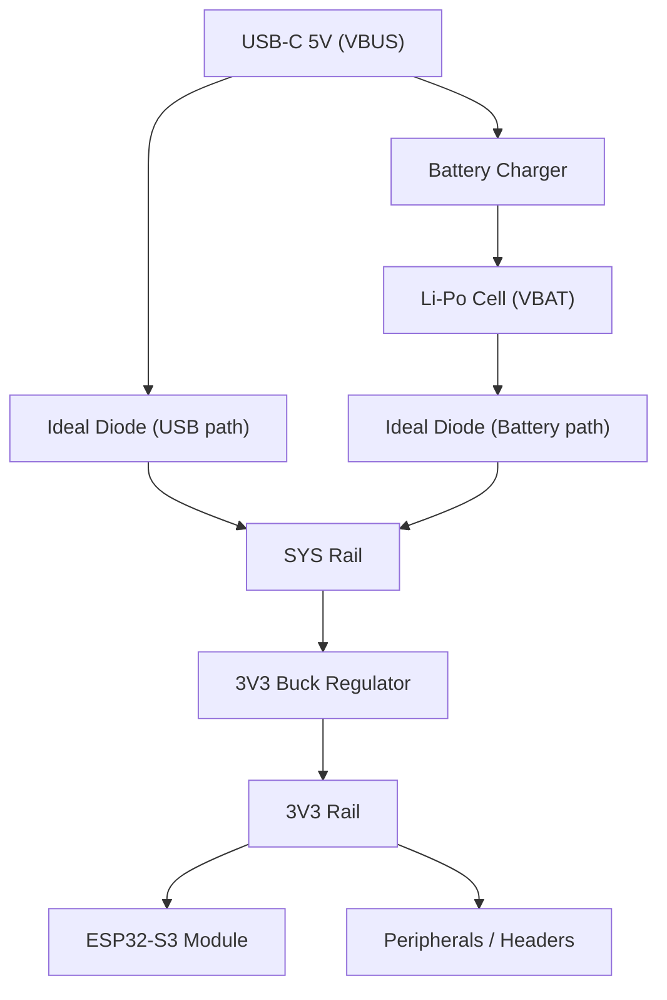

```mermaid
flowchart TD
%% Sources
USB5V["USB-C 5V (VBUS)"] --> DUSB["Ideal Diode (USB path)"]
USB5V --> CHG["Battery Charger"]
CHG --> VBAT["Li-Po Cell (VBAT)"]

%% OR-ing into system rail
DUSB --> SYS["SYS Rail"]
VBAT --> DBAT["Ideal Diode (Battery path)"]
DBAT --> SYS

%% Regulation
SYS --> BUCK["3V3 Buck Regulator"]
BUCK --> V3V3["3V3 Rail"]

%% Loads
V3V3 --> MCU["ESP32-S3 Module"]
V3V3 --> PERIPH["Peripherals / Headers"]
```

